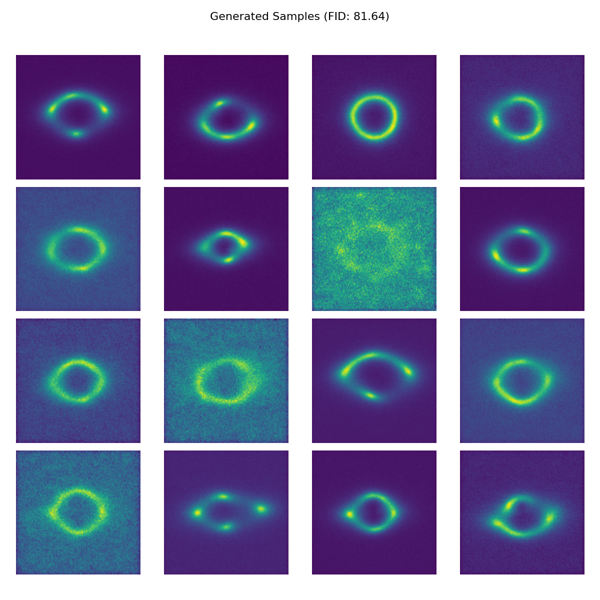
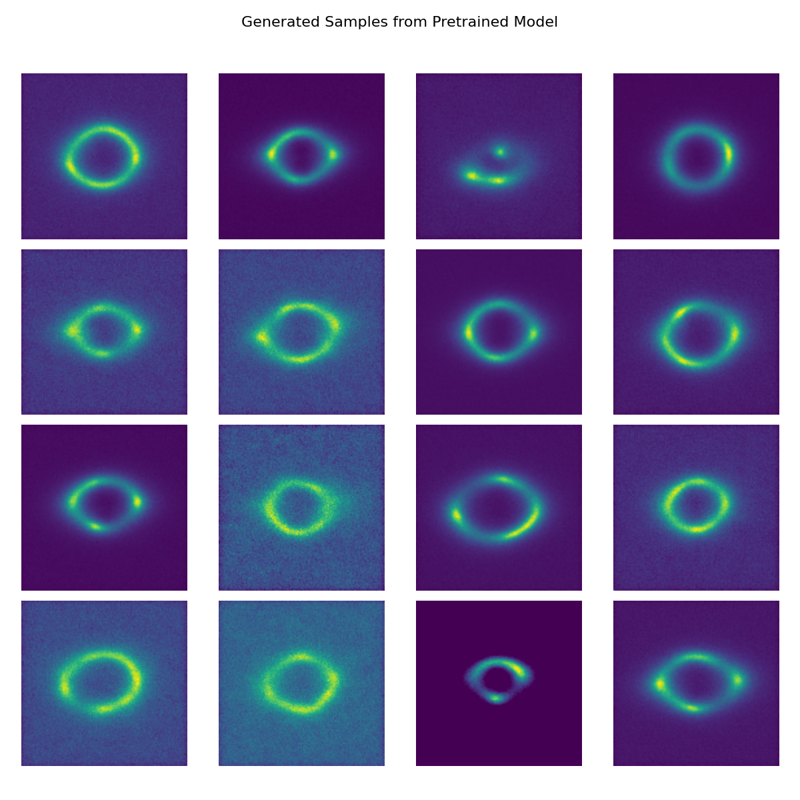

# GravLens-Diff: Diffusion Models for Gravitational Lensing Simulation

This repository contains the implementation of a diffusion-based generative model for simulating gravitational lensing effects. Diffusion models have proven highly effective for generating high-quality samples across various domains, and this project applies them to the astrophysical phenomenon of gravitational lensing.

## Links
- [Google Colab Notebook](https://colab.research.google.com/drive/1y8B_1s7pK8wpR3YxtELKp8qziEDh4edo?usp=sharing)
- [Hugging Face Model Repository](https://huggingface.co/oussamaor/gravlens)

## Approach

### Model Architecture
The model uses a UNet architecture with:
- Time-embedding using sinusoidal position embeddings
- Residual blocks for stable training
- Self-attention mechanisms in deeper layers to capture global structure
- Conditional denoising process

### Diffusion Process
We implement the standard diffusion process:
1. **Forward Process**: Gradually adds noise to the input images following a predefined schedule
2. **Reverse Process**: The model learns to denoise images step by step, eventually generating clean samples

The noise schedule uses a linear beta schedule from 1e-4 to 0.02 over 1000 timesteps, balancing sample quality and generation speed.

### Training Details
- Image size: 128×128
- Batch size: 32
- Learning rate: 2e-4
- Adam optimizer
- MSE loss for noise prediction

## Results

The model successfully generates realistic gravitational lensing images that capture the characteristic ring-like structures (Einstein rings) and arcs created by gravitational lensing effects.

### Generated Samples

*Samples generated with the trained diffusion model (FID: 81.64)*

### Pretrained Model Samples

*Samples generated from the pretrained model available on Hugging Face*

## Evaluation

The model's performance was evaluated using the Fréchet Inception Distance (FID) metric, which measures the similarity between the distribution of generated samples and real images. Lower FID scores indicate better quality and more realistic samples.

- **FID Score: 65.07**

This score indicates that while the model captures the general structure and appearance of gravitational lensing effects, there's still room for improvement in terms of fine details and variation across samples.

## Usage

### Running in Google Colab
The easiest way to use this model is through our [Google Colab Notebook](https://colab.research.google.com/drive/1y8B_1s7pK8wpR3YxtELKp8qziEDh4edo?usp=sharing), which has all dependencies pre-installed and provides a user-friendly interface for generating samples.

1. Open the Colab notebook using the link above
2. Navigate to the "Inference" section
3. Run the cells to download the model and generate samples
4. Adjust parameters as needed to customize generation

### Using the Pretrained Model
If you want to use the model in your own environment:

```python
from huggingface_hub import hf_hub_download
import torch
from model import DiffusionInference, Config

# Download the pretrained model
model_path = hf_hub_download(repo_id="oussamaor/gravlens", filename="model.pth")

# Set up configuration
config = Config()
config.model_path = model_path

# Generate samples
diffusion = DiffusionInference(config)
samples = diffusion.sample(n_samples=16)
```

## Future Work

- Fine-tuning on larger and more diverse datasets
- Exploring conditional generation based on specific lensing parameters
- Scaling up the model for higher resolution outputs
